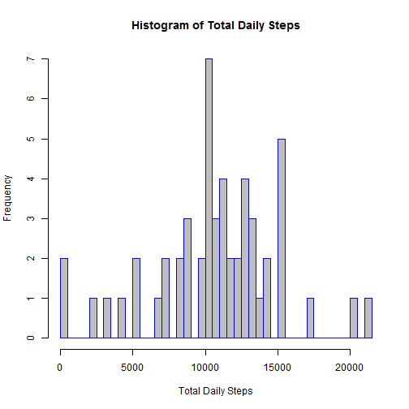
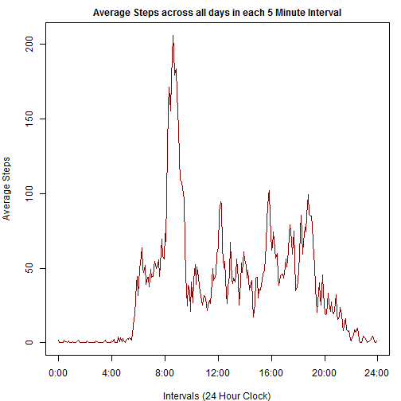
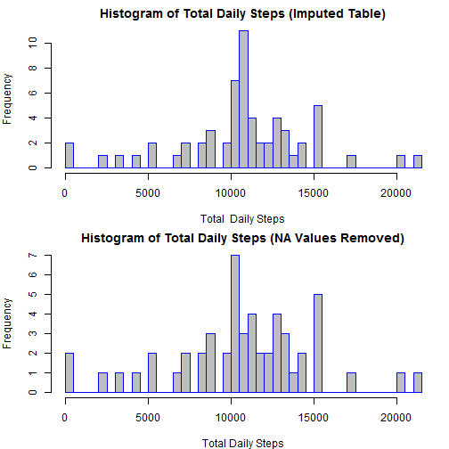
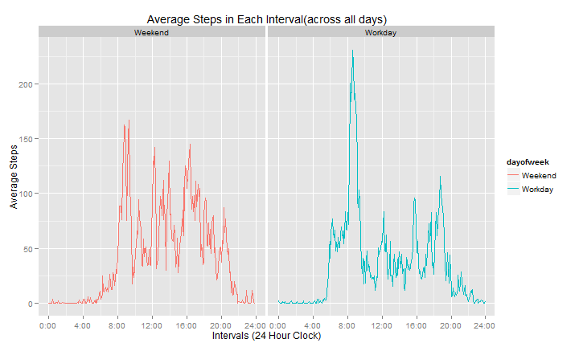

# Reproducible Research Peer Assessment 1

This document reports the analysis of the Activity Monitoring Dataset to answer the questions in the assignment.
The data file is downloaded and saved in the local working directory. 
The document delineates the steps in the analysis and the code to produce the output.

## Set Global Options for R Markdown

```r
   opts_chunk$set(echo = TRUE)
   options(scipen= 1, digits =2)
```

## Load Libraries 


```r
library(dplyr)
library(lubridate)
library(ggplot2)
```

## Read Data File 


```r
activitytable <- read.csv("activity.csv")
```

## Pre-Process the data
The raw data file uses military time, treating the numbers as integers. Due to this intervals have a jump at each hour mark, which is problematic in a time series plot. To correct this,the intervals are converted to minutes. Each day has 1440 minutes, with intervals ranging from 0 to 1435. The 24 hour clock is maintained. 


```r
    hours <- trunc(activitytable$interval/100)
    mins <- activitytable$interval-100*hours
    activitytable <- mutate(activitytable, minutes = (hours*60+mins) ) #minutes
    activitytable$date <- as.Date(activitytable$date) #date variable class

    # Note: The new variable minutes has the minutes of the day at 5 minute,equidistant intervals.
```

## Remove NA Values
Some analysis is done before removing the NA values to undersatnd the data set better. The %age of NA values in the data set is computed. Also, the % age of data for which the steps monitored are zero is also found. 


```r
    bad <-is.na(activitytable$steps) # there are NA values only in this variable
    napercent <- trunc((sum(bad)/nrow(activitytable))*100)
    zerosteps <- (nrow(subset(activitytable, steps==0))/nrow(activitytable))*100
```

The NA values are only 13 percent of the total data set. 
Also, 62.69 percent of the observations have  steps = zero.
So, it is hypothesized that removing the NA observations will not affect the results much.

A subset of the file is created with NA values removed.


```r
    good = complete.cases(activitytable$steps)
    subsettable <- activitytable [good,]
    sumgood <-sum(good)
```

The subset of the dataset with NA values removed has 15264 observations.

## Total number of Steps taken each day

The total steps in each day is computed.(Note: The NA values have been removed)


```r
    dailytable <- group_by(subsettable, date)
    totalsteps <- summarise(dailytable,sum(steps))
    colnames(totalsteps)<- c("date","sumsteps")
```

A histogram of the total steps per day is plotted.


```r
    hist(totalsteps$sumsteps, breaks = 50, col= "grey", border= "blue", 
    main= "Histogram of Total Daily Steps", xlab= "Total Daily Steps")
```

 

Mean and Median values of the Daily Total Steps are as below.


```r
   meantotdailystep <- mean(totalsteps$sumsteps)
   mediantotdailystep <-median(totalsteps$sumsteps)
```

The mean of the total steps in a day is 10766.19

The median of the total steps in a day is 10765

## Average Daily Pattern for each 5 minute interval

The average steps of each 5 minute interval on every day is computed.(Note: the NA values have been removed)


```r
    intervaltable <- group_by(subsettable,minutes)
    avesteptable <- summarise(intervaltable,mean(steps))
    colnames(avesteptable) <- c("times",  "averagesteps")
```
A plot of average steps in each 5 minute interval across all days is made as below.


```r
    par(cex=0.5,lty =1, lab= c(7,5,7))
    mylabels <- c("0:00", "4:00","8:00", "12:00", "16:00", "20:00","24:00")
    par(mfrow = c(1,1))
    par(mar = c(4,4,2,1))
    plot(averagesteps ~ times, data= avesteptable, type ="l",                    
    xlab= "Intervals (24 Hour Clock)",ylab ="Average Steps",
    col = "dark red", xaxt = "n")
    axis(1, at= c(0,240,480,720, 960,1200,1440), labels = mylabels)
    title("Average Steps across all days in each 5 Minute Interval", cex.main=1,        font.main=2)
```

 

The interval with the highest average number of steps is computed.


```r
   highestinterval <- avesteptable$times[which.max(avesteptable$averagestep)]
    highestintervalhrs<- trunc(highestinterval/60)
    highestintervalmins<- highestinterval-highestintervalhrs*60
```

The interval with the highest average steps occurs at 515 minutes, that is at 8 hours 35 minutes.


## Impute Missing Values

Compute the missing values


```r
   missingvalues <- sum(is.na(activitytable$steps))
```

There are 2304 missing values in the data set.

The strategy adopted for imputing the missing values, is to use the mean value for that 5 minute interval across all days. 
The Average steps of each interval computed for the previous question can be used for this purpose.A new dataset is created with the imputed values.


```r
    temp <- rep(avesteptable$averagesteps, nrow(activitytable)/nrow(avesteptable    ))
    imputetable <- cbind(activitytable,temp)
    count=nrow(activitytable)
    for(i in 1:count)  {
        if(is.na(imputetable$steps[i])) {
            imputetable$steps[i] = imputetable$temp[i]
        }
    }
    imputetable$temp <- NULL
```

The total daily steps of each day and the mean and median value of the total daily steps across all days are calculated for the imputed table.


```r
    impdailytable <- group_by(imputetable, date)
    imptotalsteps <- summarise(impdailytable,sum(steps, na.rm = TRUE))
    colnames(imptotalsteps)<- c("date","sumsteps")
    
    meanimptotdailystep <- mean(imptotalsteps$sumsteps)
    medianimptotdailystep <-median(imptotalsteps$sumsteps)
```
    

The histogram of the total daily steps of the Imputed table is plotted.
The histogram of the table with NA values removed  is plotted below it for ease of comparison.


```r
    par(mfrow = c(2,1))
    par(mar = c(4,4,2,1))
    par(bg ="white")
    
    hist(imptotalsteps$sumsteps, breaks = 50, col= "grey", border= "blue", 
         main= "Histogram of Total Daily Steps (Imputed Table)", xlab= "Total  Daily Steps")


   hist(totalsteps$sumsteps, breaks = 50, col= "grey", border= "blue", 
         main= "Histogram of Total Daily Steps (NA Values Removed)", xlab= "Total Daily Steps")
```

 
    
The mean and median values of the  total daily steps for the imputed table, and the original dataset with NA removed are presented in a table below.


```r
   means <- c(meantotdailystep,meanimptotdailystep)
   medians <- c(mediantotdailystep, medianimptotdailystep)
   comparison <- data.frame()
   comparison <- cbind(means,medians)
   colnames(comparison) <- c("Mean","Median")
   rownames(comparison) <- c("NA Removed", "NA Imputed")
   print(comparison)
```

```
##             Mean Median
## NA Removed 10766  10765
## NA Imputed 10766  10766
```

The histogram and the comparison table show that the imputation using the mean value of the 5 min interval affects the results very little. This could be because, as calculated before, they were only 13 percent of the total data.

## Compare Pattern of Steps on Working Days and Weekends

 The table with  NA values filled in is used for this part.

A new factor variable is created with values - workday and weekend.


```r
    imputetable = mutate(imputetable, day =wday(date))
    imputetable$temp <- NULL # Removes temporary column
    count=nrow(imputetable)
    dayofweek <- vector()
    for(i in 1:count)  {
        if(imputetable$day[i] %in% c(2:6)) #Working days Mon to Fri are 2 to 6
        {
            temp <-"Workday"
        }
        else {temp <-"Weekend"}
        dayofweek <- append(dayofweek,temp)
        }
   imputetable <- cbind(imputetable, dayofweek)
```

The average steps for each 5 minute interval is calculated for workdays and weekend categories.


```r
    intervaltable2 <- group_by(imputetable,dayofweek, minutes)
    avesteptable2 <- summarise(intervaltable2,mean(steps))
    colnames(avesteptable2) <- c("dayofweek","times","averagesteps")
```

A panel plot of the average steps in each five minute interval is made for weekends and work day categories.


```r
        ggplot(avesteptable2, aes(times, averagesteps)) +
        geom_line(aes(group=1, color=dayofweek)) +
        facet_grid(.~ dayofweek) +
        labs(title = "Average Steps in Each Interval(across all days)") +
        labs(x ="Intervals (24 Hour Clock)", y ="Average Steps") +
        scale_x_continuous(breaks = c(0,240,480,720, 960,1200,1440), labels=mylabels)
```

 

The difference between Workdays and Weekends can also be seen in the summary below.


```r
summary(subset(avesteptable2, dayofweek =="Workday")$averagesteps)
```

```
##    Min. 1st Qu.  Median    Mean 3rd Qu.    Max. 
##       0       2      26      36      51     230
```

```r
summary(subset(avesteptable2, dayofweek =="Weekend")$averagesteps)
```

```
##    Min. 1st Qu.  Median    Mean 3rd Qu.    Max. 
##       0       1      32      42      75     167
```

There is difference between the working day and weekend patterns. On working days there is a clear peak at 8 hours 35 minutes. There is less activity during the day, picking up in the evening.
On weekends, the pattern is more evenly distributed, with multiple peeks during the day. Further anlaysis will be needed to understand the reasons.

# Delete Interim Tables


```r
    rm(dailytable, intervaltable, totalsteps,avesteptable, impdailytable,avesteptable2,intervaltable2, imptotalsteps, subsettable )
```

